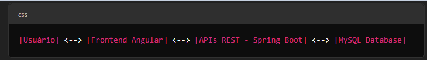
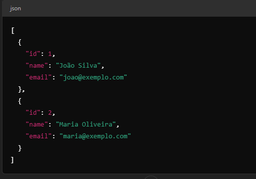
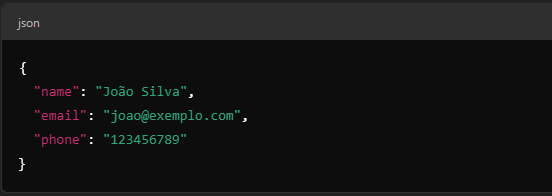

1. Visão Geral do Projeto
Nome do Projeto: MiniBiz Plataforma de Gestão para Pequenos Negócios

Objetivo:
Criar uma plataforma que permita pequenos empresários gerenciar seus negócios, com funcionalidades como controle de clientes, estoque, vendas, e relatórios. O sistema será responsivo, seguro e fácil de usar.

Principais Funcionalidades:

-   Gestão de clientes e fornecedores
-   Controle de estoque
-   Processamento de vendas
-   Geração de relatórios financeiros e de vendas
-   Controle de usuários e permissões
-   Dashboard para monitoramento de KPIs
____________________________________________________________________________________________________________

2. Requisitos Funcionais

2.1. Gestão de Clientes
-   Adicionar cliente: Permitir o cadastro de novos clientes com informações como nome, endereço, e dados de contato.
-   Editar cliente: Atualizar dados dos clientes cadastrados.
-   Deletar cliente: Excluir clientes.
-   Listar clientes: Exibir uma lista paginada de clientes cadastrados.

2.2. Controle de Estoque
-   Cadastrar produtos: Adicionar novos produtos ao sistema, com campos como nome, categoria, quantidade e preço.
-   Atualizar produto: Editar informações de produtos existentes.
-   Remover produto: Excluir produtos do estoque.
-   Consultar estoque: Visualizar a quantidade de produtos disponíveis.

2.3. Processamento de Vendas
-   Registrar vendas: Inserir informações de novas vendas, incluindo cliente, produtos vendidos, e valores.
-   Listar vendas: Exibir uma lista de vendas realizadas, com filtros por período, cliente, e status.
-   Cancelar venda: Possibilidade de cancelamento de vendas erradas ou duplicadas.

2.4. Relatórios
-   Relatório de vendas: Gerar relatórios sobre o desempenho das vendas por período.
-   Relatório financeiro: Fornecer uma visão geral das receitas e despesas.

2.5. Gestão de Usuários
-   Cadastrar usuário: Somente o Admin poderá criar novos usuários.
-   Autenticação: Implementar autenticação via OAuth2 por email/senha.
-   Controle de acessos: Definir permissões de acordo com o nível de acesso do usuário.
____________________________________________________________________________________________________________

3. Arquitetura do Sistema

Arquitetura:
O sistema utilizará uma arquitetura de 3 camadas:

1-  Frontend (Angular): Responsável pela interface com o usuário. Será uma aplicação SPA (Single Page Application) construída com Angular. Comunica-se com o backend via APIs RESTful.

2-  Backend (Spring Boot): Implementará as regras de negócio, segurança, e comunicação com o banco de dados. O backend será composto de APIs RESTful que o frontend consome.

3-  Banco de Dados (MySQL): Armazenará as informações dos clientes, produtos, vendas, e relatórios. As tabelas principais serão:

-  users (usuários)
-  clients (clientes)
-  products (produtos)
-  sales (vendas)
-  reports (relatórios)
____________________________________________________________________________________________________________

3.1. Diagrama de Arquitetura



3.2. Tecnologias Utilizadas
-   Frontend: Angular, HTML, CSS, TypeScript
-   Backend: Spring Boot 3.x, Java 17+
-   Banco de Dados: MySQL 8.x
-   Autenticação: OAuth2, JWT (Json Web Token)
-   Segurança: Spring Security, JWT, CORS
-   Gerenciamento de Dependências: Maven
____________________________________________________________________________________________________________

4. Casos de Uso
Caso de Uso 1: Cadastrar Cliente

-   Ator: Usuário autenticado (Admin ou Vendedor)
-   Descrição: O usuário preenche um formulário com os dados do cliente e clica no botão "Salvar". O sistema valida os dados e armazena no banco de dados.
-   Fluxo Principal:
    1-  O usuário acessa a tela de cadastro de cliente.
    2-  O usuário preenche os dados do cliente e envia o formulário.
    3-  O sistema valida os dados e exibe uma mensagem de sucesso.

Caso de Uso 2: Registrar Venda

-   Ator: Usuário autenticado (Vendedor)
-   Descrição: O usuário seleciona um cliente e produtos da lista de estoque, informa as quantidades e fecha a venda. O sistema armazena a venda e ajusta o estoque.
-   Fluxo Principal:
1-  O usuário acessa a tela de vendas.
2-  O usuário seleciona o cliente e os produtos, informa a quantidade e fecha a venda.
3-  O sistema registra a venda, ajusta o estoque e exibe uma confirmação.
____________________________________________________________________________________________________________

5. Banco de Dados
Estrutura das Tabelas:

-   Tabela users:
    -   id (INT, Primary Key)
    -   name (VARCHAR)
    -   email (VARCHAR, Unique)
    -   password (VARCHAR)
    -   role (VARCHAR)

- Tabela clients:
    -   id (INT, Primary Key)
    -   name (VARCHAR)
    -   address (VARCHAR)
    -   phone (VARCHAR)
    -   email (VARCHAR, Unique)

-   Tabela products:
    -   id (INT, Primary Key)
    -   name (VARCHAR)
    -   category (VARCHAR)
    -   quantity (INT)
    -   price (DECIMAL)

-   Tabela sales:
    -   id (INT, Primary Key)
    -   client_id (INT, Foreign Key)
    -   date (DATE)
    -   total (DECIMAL)
____________________________________________________________________________________________________________

6. APIs RESTful
Exemplo de API:

GET /api/clients

-   Descrição: Retorna a lista de todos os clientes cadastrados.
-   Resposta:
-   

POST /api/clients

-   Descrição: Adiciona um novo cliente ao sistema.
-   Parâmetros de Entrada:
-   
____________________________________________________________________________________________________________
7. Interface do Usuário
O front-end será uma aplicação Angular com uma interface amigável, incluindo:

-   Dashboard: Com informações resumidas de vendas e estoque.
-   Módulo de Gestão de Clientes: Formulário de cadastro, lista de clientes, e botões de ação (editar, deletar).
-   Módulo de Vendas: Registro de vendas, com seleção de clientes e produtos.
-   Módulo de Relatórios: Geração de gráficos e relatórios sobre o desempenho do negócio.
____________________________________________________________________________________________________________

8. Segurança
-   Autenticação e Autorização: A aplicação utiliza Spring Security com OAuth2 e JWT. A segurança será implementada em camadas, com autenticação para proteger endpoints e autorizações baseadas em permissões de usuário.

-   CORS: Configuração do CORS para permitir comunicações seguras entre o frontend e o backend.
____________________________________________________________________________________________________________
9. Testes
Testes Unitários: Implementar testes unitários para os principais componentes de backend usando JUnit e Mockito.

Testes de Integração: Verificar a integração dos serviços RESTful e a comunicação com o banco de dados.

Testes no Frontend: Utilizar Jasmine/Karma para testes de componentes Angular.
____________________________________________________________________________________________________________
10. Implementação e Deploy
-   Ambiente de Desenvolvimento:
    -   Backend: Spring Boot executado em um servidor local (Tomcat ou Jetty).
    -   Frontend: Servidor Angular CLI.
-   Deploy:
    -   Deploy do backend em um servidor cloud (Heroku, AWS ou Google Cloud).
    -   Frontend hospedado em um serviço como Firebase ou Netlify.
____________________________________________________________________________________________________________

+ **Create MySQL database**
  	```bash
	mysql> create database minibiz_app
	```
+ **Configure database username and password**

	```properties

	# minibiz/src/main/resources/application.properties
	spring.datasource.url=jdbc:mysql://localhost:3306/seu-banco
    spring.datasource.username=<YOUR_DB_USERNAME>
    spring.datasource.password=<YOUR_DB_PASSWORD>
	```
